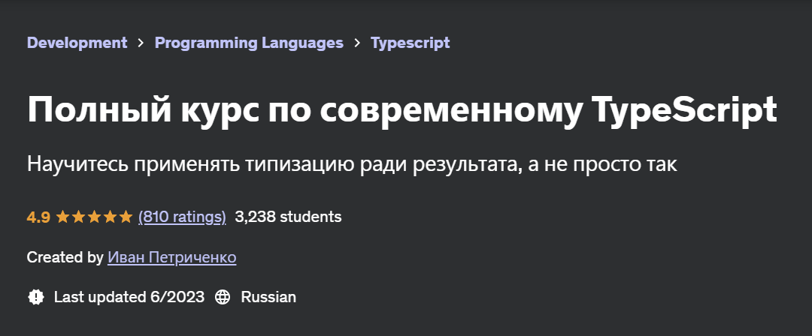
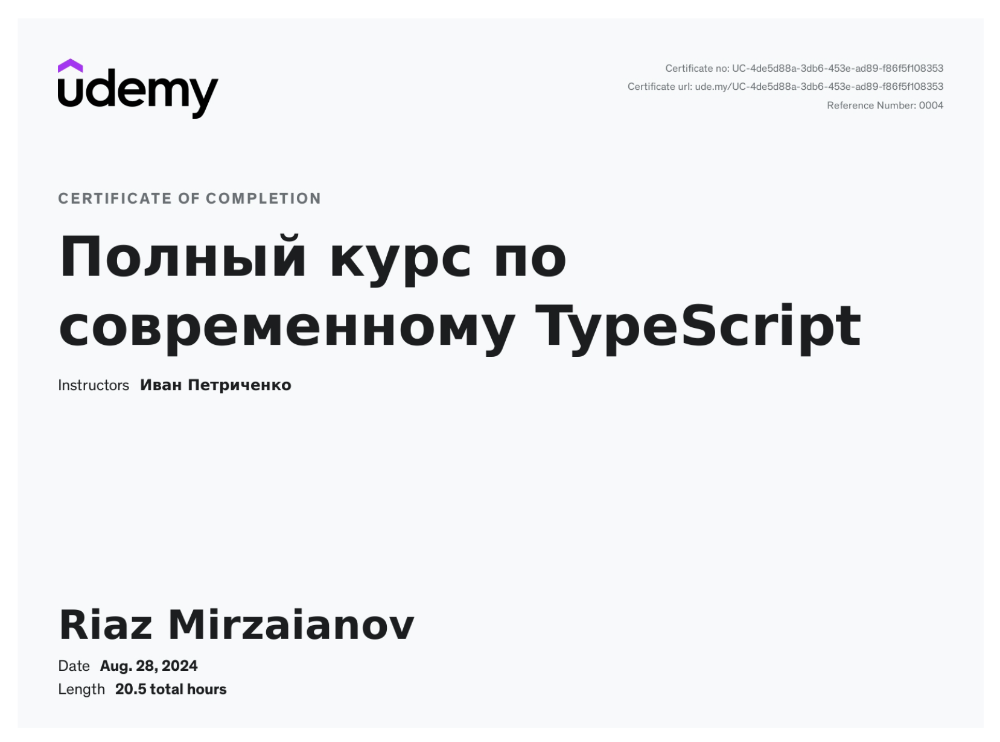

# Modern TypeScript Complete Course

## Description

Hi!

In this repo I store notes from the course of [Modern TypeScript Complete Course](https://www.udemy.com/course/modern_typescript/) by Ivan Petrychenko

